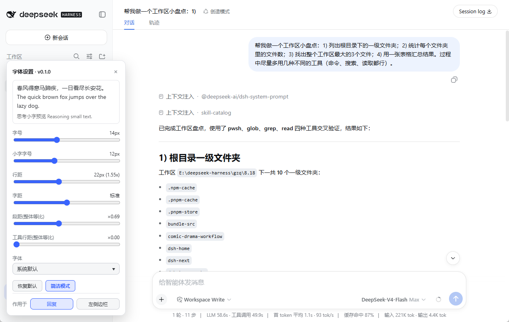

# dsh-reply-typography (字体设置)

Typography & reading-flow plugin for the DSH Web GUI. A sidebar-foot **字体设置**
(font settings) button opens a novel-reader style popup to tune the **AI reply
body** and the **left sidebar**: font size, line height, letter spacing,
paragraph gap, typeface — with live preview, per-target profiles, and
localStorage persistence.

A built-in **concise mode** (on by default) keeps the whole reply process
visible while it streams, then automatically folds tool calls and reasoning
the moment the turn settles — leaving only each turn's final answer.


| Process fully visible | Auto-folded after the turn settles |
|---|---|
|  |  |

Spacing sliders (paragraph gap / tool-row gap) are **ratio-based**: one step
scales every element family (paragraphs, lists, headings, tool rows,
sub-call stacks) from its own stock spacing, so the whole reply tightens or
loosens evenly. A separate **reasoning-row gap** slider is additive (-8..+24px, 0 = the harness's own spacing) and controls the gap between each reasoning row and its neighbouring content.

See [README.md](./README.md) for the full documentation (Chinese).

## How it works

- Size / line-height / family ride the theme override layer (`theme.overrideTokens`)
  over the `--dsw-font-markdown-*` token family; product stylesheets keep their defaults.
- Letter/paragraph/tool-row spacing flow through custom properties consumed by an
  owned static stylesheet (`calc(stock × ratio)` per element family); everything is
  removed exactly on dispose.
- Concise mode: the chat flow is a flat list of typed nodes; fold rules require a
  later `turn-tail` sibling, so the active turn stays fully visible and folds the
  instant it settles. A single document-wide MutationObserver with
  requestAnimationFrame coalescing and result caching keeps steady-state streaming
  at two small queries per frame with zero DOM writes.
- The sidebar column is hooked via `data-pane="sidebar"`, stamped by the plugin's
  own idempotent shim — no web-ui-all dependency.

## Install

```bash
pnpm --dir <profile dir> add github:linchenlan/dsh-reply-typography
```

## License

MIT
